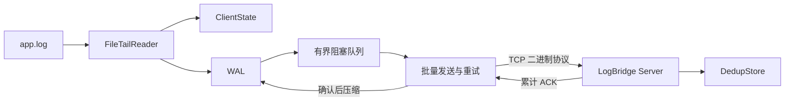

# LogBridge

LogBridge 是一个使用 C++20 编写的轻量级 Linux 日志采集与可靠传输项目。客户端增量读取日志文件，将消息写入本地 WAL 后批量发送给服务端；服务端持久化去重水位并返回累计 ACK。

项目目标不是替代成熟日志系统，而是用较小的代码规模展示文件 I/O、多线程、TCP、自定义二进制协议、持久化和故障恢复等 C++ 后端知识。

## 功能

- 增量读取日志，只返回完整的新日志行；
- 识别文件截断、inode 变化和常见日志轮转；
- 有界阻塞队列提供线程同步与背压；
- 自定义二进制协议，支持单条日志、批量日志和 ACK；
- 每批最多发送 10 条日志，最多等待 100ms；
- 客户端身份、消息 ID 和文件检查点持久化；
- WAL 保留尚未确认的消息，崩溃重启后自动重放；
- ACK 超时、自动重连和指数退避；
- 服务端按 `(clientId, messageId)` 持久化去重；
- 支持 `Ctrl+C`、`SIGINT` 和 `SIGTERM` 优雅退出；
- 输出读取、确认、重试、积压和去重等运行指标。

## 架构



客户端包含生产者和消费者两个主要工作线程：

- 生产者读取文件，分配消息 ID，先写 WAL，再更新检查点并放入队列；
- 消费者优先重放旧 WAL，然后批量发送新消息并等待 ACK；
- 有界队列满时生产者等待，未读取的数据继续保留在原日志文件中。

## 可靠性流程

一条日志的处理顺序是：

```text
读取完整行
→ 持久化分配消息 ID
→ 追加并 fsync WAL
→ 保存文件检查点
→ 进入发送队列
→ 批量发送
→ 服务端处理并持久化去重水位
→ 服务端返回 ACK
→ 客户端压缩 WAL
```

如果服务端处理成功但 ACK 丢失，客户端会重新发送相同批次。服务端根据持久化水位跳过重复消息，并再次返回 ACK。

## 编译

环境要求：

- Linux 或 WSL2；
- 支持 C++20 的 GCC；
- CMake 3.20 或更高版本；
- POSIX Threads。

```bash
cd ~/projects/logbridge
cmake -S . -B cmake-build-debug -DCMAKE_BUILD_TYPE=Debug
cmake --build cmake-build-debug --parallel
```

生成的主要程序：

```text
cmake-build-debug/logbridge
cmake-build-debug/logbridge_server
cmake-build-debug/logbridge_benchmark
```

## 运行

创建日志文件：

```bash
touch app.log
```

启动服务端：

```bash
./cmake-build-debug/logbridge_server \
    9000 \
    .logbridge-server/dedup.state
```

启动客户端：

```bash
./cmake-build-debug/logbridge \
    app.log \
    127.0.0.1 \
    9000 \
    .logbridge-data
```

在另一个终端追加日志：

```bash
echo "user login succeeded" >> app.log
echo "database connection failed" >> app.log
```

使用 `Ctrl+C` 停止客户端或服务端。未确认日志继续保留在 WAL，下次启动会优先恢复。

## 持久化文件

客户端目录：

```text
.logbridge-data/
├── client.state   客户端 ID、下一个消息 ID、文件偏移量和 inode
└── pending.wal    尚未收到 ACK 的消息
```

服务端目录：

```text
.logbridge-server/
└── dedup.state    每个客户端的最高确认消息 ID
```

多个客户端实例不能共享同一个客户端数据目录，否则可能产生相同的客户端身份和消息 ID。

## 日志轮转

读取器通过设备编号和 inode 判断原路径是否已经指向新文件。发现轮转后：

1. 先读取旧文件末尾尚未处理的内容；
2. 保存旧文件检查点；
3. 下一轮切换到新文件；
4. 从新文件开头继续读取。

如果同一个文件被截断且大小小于当前偏移量，读取器会清理半行缓冲并从文件开头重新读取。

## 运行指标

客户端每 5 秒输出一次：

```text
[指标] 已读取=100，已写 WAL=100，已确认=90，确认批次=9，重试=1，队列积压=10，WAL 待确认=10
```

服务端在确认批次后输出：

```text
[指标] 连接=1，批次=9，收到=100，有效=90，重复=10
```

## 测试

```bash
ctest --test-dir cmake-build-debug --output-on-failure
```

测试覆盖：

- 阻塞队列并发、批量获取和关闭；
- 文件增量读取、半行、CRLF、截断和轮转；
- 协议往返、非法数据、长度限制和批次；
- TCP 批量发送、ACK 校验与超时；
- 客户端状态、WAL 恢复和服务端去重持久化；
- 两个真实进程之间的端到端传输、轮转和信号退出。

## 性能基准

基准程序比较批量大小为 1、10 和 100 时的协议序列化吞吐量：

```bash
./cmake-build-debug/logbridge_benchmark
```

结果会受到 CPU、编译器和构建类型影响。

## 协议

每个帧由 12 字节固定头部和可变长度 Payload 组成：

```text
Magic | Version | Type | Reserved | PayloadLength | Payload
```

当前协议版本为 V2，整数使用网络字节序。消息类型包括：

- `Log`：单条日志；
- `LogBatch`：批量日志；
- `Ack`：服务端累计确认。

批次中的消息必须属于同一个 `clientId`，并且消息 ID 严格递增。

## 一致性与限制

当前提供的是：

```text
至少发送一次 + 服务端持久化去重
```

目前仍有以下设计边界：

- 服务端采用阻塞模型，一次处理一个客户端连接；
- 去重水位依赖同一个客户端严格按消息 ID 顺序发送；
- 服务端输出日志和更新去重状态不属于同一个事务，因此不宣称严格 Exactly Once；
- 当前基准主要衡量协议序列化，不等同于完整网络环境下的吞吐量。

如果需要支持大量客户端，可以进一步实现非阻塞 socket、`epoll` 和连接级接收缓冲区。如果最终日志写入数据库，可以利用唯一键或事务将业务处理与去重绑定。

## 目录结构

```text
include/      公共头文件
src/          客户端、服务端和核心实现
tests/        单元测试、网络测试和端到端测试
benchmarks/   性能基准
CMakeLists.txt
README.md
```
